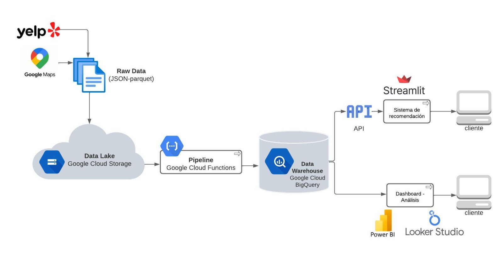
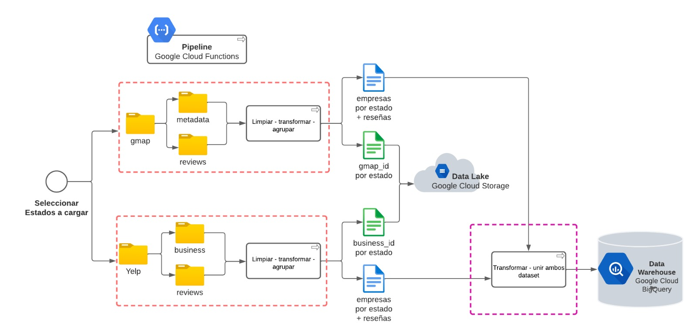
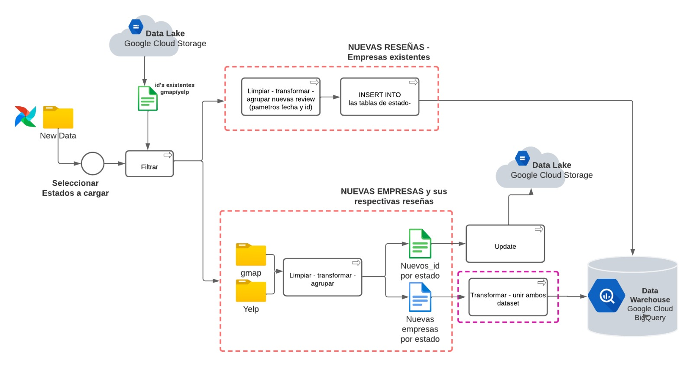
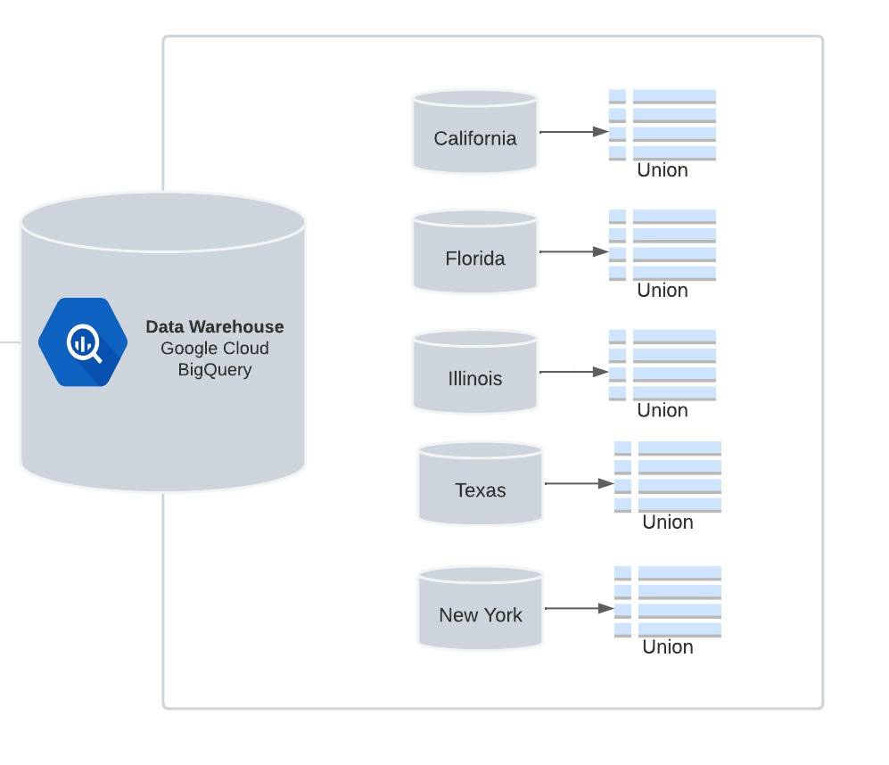
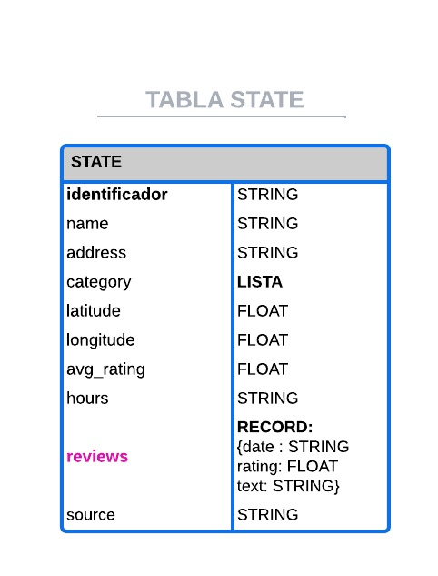

**ESQUEMA DE PROBLEMÁTICA Y SOLUCIONES PARA INVERSIONES EMPRESARIALES** 📈💼🏨🍽️

**PROBLEMÁTICA:**

Para que un empresario esté interesado en invertir en negocios, restaurantes, hoteles o servicios, tiene que tomar decisiones informadas basadas en datos y análisis significativos. El empresario quiere conocer la imagen que tienen los usuarios de diferentes locales y la percepción del servicio que ofrecen. Además, desea entender cómo las opiniones y reseñas en plataformas como Yelp y Google Maps, y otras plataformas confiables, pueden influir en el rendimiento y la utilidad del negocio. El empresario también está interesado en identificar tendencias y oportunidades de inversión en comercios en expansión, para mejorar las estrategias de marketing y tomar decisiones inteligentes en su cartera de inversiones.

**SOLUCIÓN PROPUESTA:**

Para abordar esta problemática, se propone un enfoque integral que incluya la recopilación, depuración y disponibilización de datos de diferentes fuentes, la realización de análisis significativos y la implementación de machine learning para el beneficio del empresario.

| Paso | Descripción |
|-----|-----------|
| 1 | 📊 Recopilación de los Datos: Se utilizarán diversos datasets disponibles, como los proporcionados en la unidad de almacenamiento “drive”. Estos datasets incluyen información de negocios, reseñas, tips y usuarios. Además, se explorará la posibilidad de incorporar datos adicionales, como cotizaciones en la bolsa de valores, tendencias en redes sociales y medios de comunicación sobre comercios en expansión. |
| 2 | 🧹 Depuración de Datos y Creación del DataWareHouse: Los datos se limpiarán y estructurarán adecuadamente para formar un DataWareHouse. Se combinarán los datos de diferentes fuentes, y se realizará un proceso de ETL (Extracción, Transformación y Carga) para crear una base de datos coherente y lista para su análisis. [Data Warehouse](dw.md)|
| 3 | 📝 Análisis de Opiniones y Reseñas: Se llevará a cabo un análisis de texto para extraer información significativa de las reseñas y opiniones de los usuarios en Yelp y Google Maps. Se emplearán técnicas de procesamiento de lenguaje natural (NLP) para identificar tendencias, patrones y sentimientos en las opiniones de los usuarios. [KPI](kpi.md)|
| 4 | 💡 Sistema de Recomendación: Se desarrollarán modelos de recomendación para proporcionar al empresario recomendaciones personalizadas sobre posibles lugares de inversión, como restaurantes, hoteles u otros servicios. Estos sistemas de recomendación se basarán en el análisis de las reseñas y opiniones de los usuarios, así como en otros datos relevantes, para ofrecer sugerencias precisas y pertinentes. |
| 5 | 🤖 Modelos de Machine Learning para Clasificación: Se entrenarán modelos de Machine Learning supervisados y no supervisados para resolver problemas específicos relacionados con la inversión. Por ejemplo, se puede desarrollar un modelo de clasificación para predecir el éxito o rentabilidad potencial de un negocio en función de diversas características y opiniones de los usuarios. |
| 6 | 🎯 Mejoramiento de Estrategias de Marketing: Con la información obtenida de los análisis y modelos, se podrá diseñar campañas de marketing microsegmentadas, dirigidas a públicos específicos con intereses y preferencias particulares. Esto le permitirá al empresario promocionar y posicionar los negocios de manera más efectiva, aumentando su visibilidad y atrayendo a potenciales clientes. |
| 7 | 🌟 Identificación de Oportunidades de Inversión: El análisis de datos, combinados con la información de comercios en expansión y tendencias de mercado, permitirá al empresario identificar oportunidades de inversión prometedoras. Esto incluirá la identificación de áreas geográficas con alta demanda y la identificación de negocios con potencial de crecimiento y éxito. |

Con esta solución integral, el empresario podrá tomar decisiones de inversión más informadas y estratégicas, basadas en datos y análisis sólido. Además, podrá mejorar sus estrategias de marketing y optimizar su cartera de inversiones para obtener mejores resultados y maximizar el rendimiento de sus inversiones. 🚀💰💡

**ARQUITECTURA DEL PROYECTO**

**PIPELINE DE DATOS:**

**CARGA INCREMENTAL:**

**MODELADO DEL DARA WAREHOUSE:**

**DICCIONARIO DE DATOS:**
